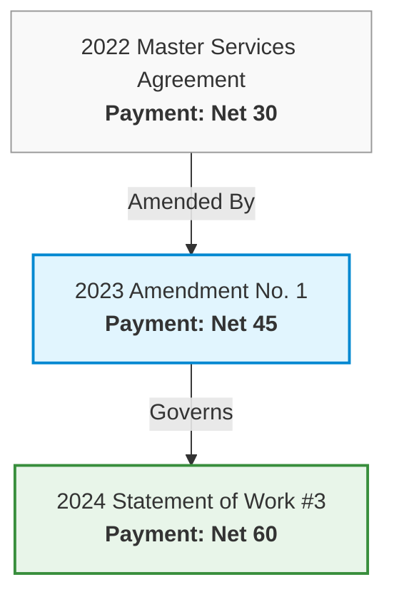

# The Ingestion Imperative: Why RAG Fails or Flourishes Before the LLM Reads a Single Word

> **Author**: Kevin Ruschman  
> **Date**: September 2026  
> **Topic**: Document Engineering, Vector Embeddings, Ingestion Pipelines, and Sovereign RAG Architecture  
> **Published in**: [KruschNexus Architecture Documentation](file:///home/krusch/homelab/projects/krusch-nexus/docs/)

---

## Executive Summary

Over the past two years, the enterprise artificial intelligence conversation has fixated almost exclusively on the generative layer: Which frontier model has the largest context window? How clever is your system prompt? Can an agentic reasoning loop self-correct?

Yet behind closed doors, an estimated 70% to 80% of enterprise generative AI pilots stall or fail when applied to real internal company documents.

The failure rarely lies in the language model's ability to reason or synthesize. Instead, the failure occurs long before the prompt is assembled. It happens at the **ingestion boundary**—the unglamorous, foundational plumbing where messy real-world documents (multi-column PDFs, scanned vendor contracts, municipal ordinances, spreadsheet tables, email threads) are converted into digital chunks and vector embeddings.

When companies treat Retrieval-Augmented Generation (RAG) as a simple matter of buying a vector database and calling an off-the-shelf text-splitting script, they guarantee failure. This article explains:
1. Why foundation models cannot solve your internal business problems without your own private data.
2. What vector embeddings actually represent—and the dangerous misconceptions teams have about what they can and cannot do.
3. Why the document ingestion pipeline is the single most critical determinant of retrieval accuracy.
4. How to engineer an ingestion pipeline that preserves layout, citations, numeric slots, and document hierarchies.

---

## 1. The Illusion of the All-Knowing Model

Modern large language models (LLMs) appear deceptively omniscient. They write Python scripts, summarize medical research, explain quantum physics, and draft eloquent marketing copy.

Because of this fluency, business leaders routinely suffer from what can be called the **Pretraining Fallacy**: the subconscious belief that because a model has read trillions of tokens on the public internet, it somehow understands their company.

### The Reality: Foundation Models Know Zero Percent of Your Business

A frontier model knows everything about generic contract drafting conventions in Delaware corporate law. It knows **zero percent** about:
- The custom indemnity carve-out your GC negotiated in the 2023 Acme Corp Master Services Agreement.
- The specific equipment warranty terms agreed upon in Exhibit B of Purchase Order 4812.
- The exact maintenance runbook your SRE team updated last Tuesday after a database failover incident.
- The municipal rent-stabilization exemption that applies only to a specific zip code under a local rent board ordinance passed six months ago.

When an LLM is asked a question about proprietary, internal, or time-sensitive operational reality, it faces an impossible dilemma. It has only two choices:
1. **Admit ignorance** (which models are trained to resist in typical conversational interfaces).
2. **Hallucinate a plausible-sounding fiction** using statistical pattern-matching from general internet prose.

In consumer chat, a hallucination is a quirky annoyance. In enterprise operations—such as legal review, medical charting, compliance auditing, or financial underwriting—a hallucination is an existential liability.

### Why Fine-Tuning Is Not the Solution for Internal Knowledge

When executives realize the base model does not know their company's data, the immediate instinct is often: *"Let's fine-tune the model on all our internal PDFs."*

This is almost always a costly mistake.

| Dimension | Fine-Tuning | Retrieval-Augmented Generation (RAG) |
| :--- | :--- | :--- |
| **Primary Purpose** | Teaches **behavior, tone, syntax, and task style**. | Supplies **dynamic, verifiable, factual ground truth**. |
| **Updating Knowledge** | Requires full model retraining or expensive LoRA cycles whenever a contract changes. | Instantaneous: add, update, or supersede a document in the index in seconds. |
| **Citation & Auditing** | **Zero traceability**. You cannot point to the exact weight or neuron that produced an answer. | **100% auditable**. Answers cite specific page numbers, sections, and source filenames. |
| **Access Control (ACLs)** | Near impossible. All trained knowledge is blended into model weights accessible to anyone querying it. | Native. Filter chunks by tenant, department, security clearance, or user token. |
| **Hallucination Risk** | High. Models memorize fuzzy probabilistic distributions, not rigid fact sheets. | Low. The model acts as an open-book analyst constrained strictly to retrieved context. |

Fine-tuning is for teaching an actor how to speak like a British barrister or an oncology specialist. **RAG is handing that actor the specific case file and evidence binder for today's 9:00 AM trial.**

---

## 2. De-Mystifying the Math: What Is an Embedding, Really?

Much of the confusion surrounding RAG stems from the word **"embedding."** Marketing literature often portrays embeddings as an esoteric form of artificial consciousness or a "brain index" that magically understands documents.

In software reality, an embedding is simply a **mathematical vector**—a list of floating-point numbers (such as 1,024 numbers produced by a model like `bge-large`) that maps a snippet of text to a coordinate in high-dimensional geometric space.

### The Library Geometry Analogy

Imagine a massive, multidimensional warehouse:
- The sentence *"The tenant shall deposit a security bond within thirty days"* gets assigned a coordinate near `[0.082, -0.412, 0.198, ...]`.
- The sentence *"A damage deposit is due from the lessee one month following lease execution"* gets assigned a coordinate near `[0.085, -0.405, 0.201, ...]`.

Because these two sentences describe the same fundamental semantic concept, their coordinates are located right next to each other in the warehouse. When an investigator asks, *"When does the lessee have to pay their deposit?"*, the system translates the query into a coordinate and looks for whatever stored text snippets sit closest in space (measured by **cosine similarity**).

### What Embeddings Do NOT Know: The Dangerous Blind Spots

Because vector search feels like magic when matching synonyms ("dog" matches "canine"), non-technical stakeholders assume it understands documents the way a human lawyer or engineer does.

It does not. Embeddings have severe, structural blind spots that ruin naive RAG systems:

#### 1. Embeddings Are Blind to Negation and Contradiction
In geometric space, a sentence and its polar opposite share almost identical vocabulary, topics, and conceptual neighborhood:
- *"The Landlord shall be liable for water damage resulting from roof failure."*
- *"The Landlord shall under no circumstances be liable for water damage resulting from roof failure."*

To a vector model, both sentences are intensely about *landlords, liability, water damage, and roof failure*. Their cosine similarity is often greater than 0.92! If your RAG system relies solely on vector similarity, it has no intrinsic mechanism to understand that one sentence grants a claim and the other explicitly strips it away.

#### 2. Embeddings Cannot Do Numeric Logic or Date Comparison
A vector embedding has no concept of numbers, thresholds, or time:
- *"Payment is due Net 30."*
- *"Payment is due Net 90."*

These two sentences will embed to virtually identical coordinates. A query asking *"Find all contracts with payment terms longer than 60 days"* will retrieve both Net 30 and Net 90 documents with equal fervor. Vector math cannot evaluate mathematical inequalities (`> 60`).

#### 3. Embeddings Have No Sense of Authority or Precedence
If your company signed a Master Agreement in 2021 specifying Delaware governing law, and signed an Amendment in 2024 changing governing law to California, a vector search for *"governing law"* will retrieve both.

Because the vector model does not know which document is controlling, which is expired, and which is an amendment, it will casually feed both to the LLM. The LLM will then either guess or hallucinate a synthesis that mixes California statutory rules with Delaware corporate procedure.

---

## 3. Why the Ingestion Pipeline Makes or Breaks Retrieval

There is an old aphorism in computer science: **Garbage In, Garbage Out.**

In generative AI, that rule must be upgraded: **Garbage In, Confident Hallucination Out.**

Retrieval quality is bounded entirely by the structural fidelity of the chunks stored in your database. If the ingestion pipeline destroys document structure, no downstream prompt engineering or model scale can recover it.

Here are the four fatal failure modes of naive ingestion pipelines:

```
┌─────────────────────────────────────────────────────────────────────────────┐
│                       THE NAIVE RAG INGESTION TRAP                          │
│                                                                             │
│  [Complex PDF / DOCX]                                                       │
│          │                                                                  │
│          ▼                                                                  │
│  (Naive PyPDF text dump)       ───► Destroys multi-column order, drops OCR  │
│          │                                                                  │
│          ▼                                                                  │
│  (RecursiveCharacterSplitter)  ───► Slices legal clauses mid-sentence       │
│          │                                                                  │
│          ▼                                                                  │
│  (Uniform Vector Embedding)    ───► Drops page numbers, drops section tags  │
│          │                                                                  │
│          ▼                                                                  │
│  [Hallucinating LLM]           ───► Confidently cites wrong terms & pages   │
└─────────────────────────────────────────────────────────────────────────────┘
```

### Failure Mode 1: The Dumb Parser (Scrambling Complex Layouts)

Enterprise documents rarely look like clean blog posts. They are:
- Multi-column legal briefs and academic papers.
- PDFs containing scanned pages intermixed with digital text.
- Financial tables with merged header cells and nested sub-rows.
- Documents stamped with diagonal Bates numbers, fax transmission footers, and confidential watermarks.

When an off-the-shelf tutorial script runs `pypdf.extract_text()`, it reads text streams sequentially by byte offset rather than spatial layout. A two-column document that reads left-column-then-right-column gets read horizontally straight across the page:
> *"The Company agrees to pay... (Column 1) ...the Employee shall maintain... (Column 2) ...the full annual salary... (Column 1) ...strict trade secret confidentiality... (Column 2)."*

The resulting text is complete nonsense. The vector model embeds this garbled chimera, and your RAG engine is poisoned from second one.

**The Solution**: A production ingestion spine must employ layout-aware parsing (e.g. Poppler utilities like `pdftotext -layout`), integrated Tesseract OCR fallback for low-confidence image layers, and dedicated table extraction modules that serialize tabular structures as markdown or key-value pairs before chunking.

---

### Failure Mode 2: The Chunking Crime (Arbitrary Character Counts)

The single most common mistake in modern AI engineering is using fixed-length character splitters:
```python
# The hallmark of an amateur RAG pipeline:
splitter = RecursiveCharacterTextSplitter(chunk_size=1000, chunk_overlap=200)
```

Documents are not strings of arbitrary characters; they are hierarchical structures composed of **titles, articles, sections, clauses, and lists**.

When a fixed-character splitter hits character 1,000, it slices the document with an axe. If character 1,000 happens to fall between:
> *"Section 14.2 Limitation of Liability: In no event shall either party's liability exceed..."*
and
> *"...the total fees paid in the preceding twelve (12) months."*

Chunk A gets the header with no number. Chunk B gets the number with no context or header.

When an analyst later asks, *"What is the limitation of liability under the contract?"*, Chunk A retrieves with high semantic score, but tells the LLM nothing about the monetary cap. The LLM either reports that the contract has no cap, or hallucinates an arbitrary number.

**The Solution**: Ingestion must be **semantically and syntactically aware**. Chunks must break at natural boundaries:
- Markdown headers (`#`, `##`, `###`).
- Statutory section markers (`Section 1947.12`, `§ 8.22`, `Article IV`).
- Paragraph breaks and numbered lists.
- If a section exceeds the maximum vector embedding context, it must be chunked with explicit parent-child header propagation so every subsection carries its parent locator in its chunk header.

---

### Failure Mode 3: The Disappearing Locator (Killing the Citation Spine)

When a human lawyer or compliance officer reviews a legal memo, their first question is always: **"Where does it say that?"**

If your memo says:
> *"Under the Master Agreement, late invoices accrue interest at 1.5% per month."*

The reviewer must be able to click directly through to:
> **`Acme_MSA_2024.pdf`, Page 14, Section 6.3(b), Lines 12-15.**

In naive RAG pipelines, chunks are saved with no metadata other than the raw filename (`source: "Acme_MSA_2024.pdf"`). The physical page number is discarded. The exact section header is discarded. The character start and end offsets are discarded.

When the LLM generates a response, it is asked to provide citations. Having no physical page numbers in its retrieved context, the LLM does what it always does: **it invents believable page numbers**.

**The Solution**: A sovereign document engine must implement a **verifiable citation spine** at ingestion time:
- Store the physical `page_number`.
- Store the hierarchical `heading_path` (e.g., `["Agreement", "Article VI: Payment", "Section 6.3: Late Fees"]`).
- Store the exact character span offsets (`char_start`, `char_end`) within the raw document.
- Verify in downstream tests that any cited claim can be mapped back to a bit-for-bit slice of the source file.

---

### Failure Mode 4: The Multi-Version Temporal Trap (Ignoring State & Supersession)

In real companies, documents do not exist in isolation. They form a living, conflicting **relational graph**:



If an analyst queries: *"What are our current payment terms with Counterparty X?"*, what happens in standard RAG?
- The vector store finds three relevant chunks: the 2022 MSA (Net 30), the 2023 Amendment (Net 45), and the 2024 SOW (Net 60).
- Because all three chunks discuss payment terms with high semantic density, their vector similarities are almost identical.
- If the 2022 MSA chunk happens to rank first, the LLM will confidently declare: *"Payment terms are Net 30."*

This is not a failure of model intelligence. **It is an ingestion failure.** The ingestion pipeline treated contracts as independent bags of text rather than nodes and edges in a contract graph.

**The Solution**:
- **Relational Ingestion**: Capture explicit inter-document relationships at ingest (`AMENDS`, `SUPERSEDES`, `INCORPORATES`, `SCHEDULE_OF`).
- **State & Supersession Tracking**: Maintain active vs superseded flags (`is_superseded = true/false`, `effective_date`, `expiration_date`).
- **Graph-Aware Resolvers**: Walk the graph to determine the controlling document before passing retrieved context to the LLM.

---

## 4. The Antidote: Hybrid Search + Structured Slot Extraction

To achieve high-precision retrieval on proprietary documents, modern RAG systems must abandon the fantasy that vector search alone is sufficient.

A production retrieval engine requires a two-pronged architecture:

### 1. Hybrid Search (Dense Vectors + Lexical Inverted Index)

| Search Mechanism | What It Excels At | What It Fails At |
| :--- | :--- | :--- |
| **Dense Vector Embeddings** (e.g. `bge-large`) | Conceptual matching, paraphrases, synonyms, thematic queries ("termination due to insolvency"). | Specific part numbers, legal section identifiers, exact proper nouns, acronyms ("§ 1947.12", "ISO-9001"). |
| **Sparse Lexical Search** (e.g. PostgreSQL `tsvector`, BM25) | Exact token matches, legal citations, part numbers, section labels, error codes. | Synonyms, reworded concepts, cross-lingual context. |

By combining both through **Reciprocal Rank Fusion (RRF)**:
$$\text{RRF Score}(d) = \sum_{m \in \{\text{vector}, \text{lexical}\}} \frac{1}{k + \text{rank}_m(d)}$$
the system guarantees that if a lawyer searches for *"Section 1946.2 just cause eviction"*, the lexical engine locks onto the exact section label while the vector engine locks onto the conceptual meaning of eviction protections.

### 2. Structured Slot Extraction at Ingestion Time

Instead of expecting the vector embedding to encode complex numeric rules, the ingestion pipeline should extract key business parameters into structured columns alongside the text chunk:

```json
{
  "chunk_id": "chunk_8129",
  "document": "Vendor_MSA_2024.pdf",
  "section": "Section 9.1 Payment Terms",
  "content": "Undisputed invoices shall be paid Net 45 days. Late invoices accrue 1.5% monthly interest.",
  "structured_slots": {
    "topic": "PAYMENT_TERMS",
    "net_days": 45,
    "late_fee_pct": 1.5,
    "currency": "USD"
  },
  "citation": "Vendor_MSA_2024.pdf p.12 § 9.1",
  "controlling_status": "OPERATIVE"
}
```

Now, when a user asks: *"Show me all vendor agreements with payment terms exceeding Net 30"*, the system does not gamble on vector similarity. It runs an indexed SQL query:
```sql
SELECT document, section, content, citation
FROM document_chunks
WHERE structured_slots->>'topic' = 'PAYMENT_TERMS'
  AND CAST(structured_slots->>'net_days' AS INT) > 30
  AND controlling_status = 'OPERATIVE';
```
This is how code matches claims. The retrieval is mathematically exact, 100% auditable, and impossible to hallucinate.

---

## 5. Data Sovereignty and the Air-Gapped Advantage

As companies begin to understand the necessity of using their own proprietary documents, they immediately hit a security wall: **Data Sovereignty**.

Enterprise documents contain your most guarded assets:
- Unannounced product source code and patent applications.
- Trade secrets, proprietary algorithms, and pricing formulas.
- Executive compensation packages and severance agreements.
- Personally Identifiable Information (PII) of employees and clients subject to GDPR, CCPA, and HIPAA.

### The Dangers of the Cloud API Shortcut

Sending your entire corporate document repository to public cloud endpoints introduces profound risks:
1. **Third-Party Data Ingestion**: Even with zero-retention enterprise agreements, sensitive customer data crosses network perimeters and is subject to subpoena, data leaks, or employee access on the vendor's side.
2. **Silent Model Deprecation**: A cloud provider updates or changes an embedding model version, silently shifting the geometric coordinates of your vector space and breaking your existing vector database overnight.
3. **Egress Costs & Rate Limits**: Ingesting terabytes of corporate PDFs through commercial cloud APIs incurs heavy monthly costs and exposes your core pipelines to unpredictable rate limits.

### The Sovereign, Local-First Architecture

The modern state of open-source tooling makes sovereign, air-gapped RAG not just viable, but superior:
- **Local Embeddings**: High-performance local embedding models (such as BAAI's `bge-large-en-v1.5`, 1024 dimensions) run locally on commodity GPUs or modest workstation hardware, outperforming earlier cloud embeddings while ensuring zero bytes leave the premises.
- **Local Relational & Vector Stores**: PostgreSQL with `pgvector` or local SQLite databases handle millions of vectors and hybrid full-text search with sub-10ms latency.
- **Local Inference**: Modern quantized local reasoning models (such as Llama 3, Mistral, or Qwen running via local inference engines) allow complete closed-loop synthesis without external network egress.
- **Strict Loopback Binding**: Binding web services and MCP servers strictly to `127.0.0.1` guarantees that even if a network adapter is active, internal document data cannot be exposed across the LAN or WAN.

---

## 6. Real-World Scenarios: How Sovereign RAG Transforms Business and Law

To see why local, air-gapped RAG is not just a theoretical architecture but an operational necessity, consider two concrete real-world workflows in environments where **confidential data can never leave the building**.

---

### Case Study 1: The Law Office — Multi-Document Tenant Dispute and Retaliatory Eviction Defense

#### The Setup & The Confidential Data
A boutique litigation firm represents a commercial or residential client facing an unlawful detainer (eviction) action and an unexpected rent increase. The client's file contains:
- The original 2020 lease agreement (PDF, 28 pages).
- Three subsequent annual rent increase notices (scanned 1-page letters).
- A 60-message email thread between the tenant and property management documenting persistent plumbing failures and water damage.
- Photographs of property conditions and an inspection report from the city code enforcement agency.

#### The Zero-Egress Constraint
Under **ABA Model Rule 1.6** and state ethics guidelines, attorneys have an ethical duty to safeguard client confidences. Uploading unredacted client leases, financial records, eviction notices, and private email correspondence to a commercial multi-tenant cloud API (such as OpenAI or Anthropic) introduces severe privilege and confidentiality risks:
- The data crosses network perimeters to third-party servers.
- The terms of service may permit vendor review, logging, or sub-processor access.
- Any unauthorized disclosure can be argued by opposing counsel as a **waiver of attorney-client privilege**.

The entire pipeline must run **on-premise or within a private sovereign environment**. No packets may leave the local firewall.

#### The Traditional Manual Workflow
1. A junior associate or paralegal spends 4 to 6 hours reviewing the 28-page lease and the three separate notice letters.
2. They manually calculate whether the compounding rent increases violate California Civil Code § 1947.12 (the Tenant Protection Act / AB 1482) or local rent board caps (e.g., Oakland or San Francisco).
3. They sift through 60 emails to build a chronological timeline: *When did the tenant complain about the leak? When did the landlord serve the notice to quit?*
4. They cross-reference whether the notice was served within the 180-day statutory window of California Civil Code § 1942.5(a) to establish the affirmative defense of retaliatory eviction.

#### The Sovereign RAG + LLM Workflow
1. **Local Ingestion (`krusch-nexus`)**:
   - The lease, notices, and `.eml` email files are dropped into the matter folder.
   - The parser extracts clean text, preserves page numbers, tags headers, and records exact character spans.
   - Crucially, dates and rent amounts are extracted into structured slots:
     - `Lease p.3 § 4`: `$2,400/month`, Effective Date `2020-04-01`.
     - `Notice 3 p.1`: Increase to `$2,688/month` (12.0%), Served `2024-06-01`.
     - `Email thread msg #42`: Written complaint to landlord regarding water intrusion, Sent `2024-04-18`.
2. **Local Hybrid Retrieval & Graph Traversal**:
   - The attorney enters a query: *"Did the June 2024 rent increase violate statutory caps, and does the timing of the notice support an affirmative defense of retaliatory eviction under Cal. Civ. Code § 1942.5?"*
   - The engine uses hybrid search to pull the statutory provisions (§ 1947.12 and § 1942.5), the controlling lease rent clause, the June 2024 notice, and the April 2024 complaint email.
3. **Local LLM Synthesis & Grounding Audit**:
   - The local model (running via loopback on an internal workstation or server) produces an immediate issue-spotting analysis:
     - **Finding 1: Unlawful Rent Increase**: The June 2024 notice attempted a 12.0% increase. The regional CPI-based statutory cap for Alameda County for that period was 8.8% (5% + 3.8% CPI). The increase exceeds the legal cap by 3.2%.
     - **Finding 2: Retaliatory Eviction Defense**: The landlord served the notice to quit 44 days after the tenant's documented written habitability notice (April 18 vs. June 1). Under Cal. Civ. Code § 1942.5(a)(1), an adverse action within 180 days of an oral or written complaint creates a rebuttable presumption of retaliation.
     - **Grounding Audit**: Every single assertion displays an interactive, clickable citation:
       - `[Source: Smith_Lease_2020.pdf, Page 3, § 4]`
       - `[Source: Notice_of_Increase_2024.pdf, Page 1]`
       - `[Source: Client_Emails.eml, Message 42, 2024-04-18]`
       - `[Source: Cal_Civ_Code_1942.5.md, § 1942.5(a)(1)]`
4. **The Impact**:
   - Time elapsed: **under 45 seconds**.
   - Zero human error in date arithmetic or section cross-referencing.
   - Complete attorney-client privilege preservation: **0 bytes transmitted externally**.

---

### Case Study 2: The Enterprise Business — M&A Diligence and Vendor Contract Conflict Audit

#### The Setup & The Confidential Data
A mid-market enterprise with 250 enterprise vendor contracts is preparing for a strategic acquisition. As part of due diligence, the acquiring party demands a comprehensive risk matrix of:
- All agreements with unlimited liability or indemnities uncapped by fees.
- All agreements requiring under 72 hours for data breach notifications.
- All contracts containing Most Favored Nation (MFN) pricing clauses or non-competes.
- Any conflicting terms between Master Services Agreements (MSAs) and Statements of Work (SOWs).

The document set includes 250 master contracts, 400 statements of work, and 120 amendments spanning eight years of operational history.

#### The Zero-Egress Constraint
Enterprise vendor agreements and customer contracts are bound by strict Non-Disclosure Agreements (NDAs). Leaking non-public pricing tiers, liability caps, or customer names to a public cloud API constitutes a material breach of contract that could jeopardize the entire acquisition or invite multimillion-dollar breach litigation.

#### The Traditional Manual Workflow
1. The company hires an external contract review team or assigns three internal corporate counsels.
2. At billing rates of $350–$650/hour, the review team manually reviews 770 documents over three to four weeks.
3. Reviewers get tired. On page 42 of an obscure SOW signed in 2022, a junior reviewer misses a one-sentence clause where a vendor successfully inserted an uncapped indemnification for intellectual property infringement.
4. The resulting spreadsheet is rife with version mismatches: the spreadsheet records the payment terms from the 2018 MSA (Net 30) without realizing that a 2023 Amendment changed terms to Net 60.

#### The Sovereign RAG + LLM Workflow
1. **Local Relational Ingestion (`krusch-biz` + `krusch-nexus`)**:
   - The entire 770-document corpus is ingested into an on-premise relational database.
   - The parser extracts clauses, maps parent-child agreement trees (`MSA → Amendment 1 → SOW 4`), and parses structured slots:
     - `liability_cap_multiplier`: e.g., `12_months_fees` or `uncapped`.
     - `breach_notice_hours`: e.g., `24`, `48`, `72`.
     - `net_payment_days`: e.g., `30`, `45`, `60`.
2. **Controlling Document Resolution**:
   - Instead of asking a vector database to guess which agreement is active, the engine’s **Graph Resolver** walks the edges between documents:
     - It marks superseded clauses as inactive.
     - It flags **Active Contract Conflicts** before the LLM even drafts a report:
       > *Conflict Warning*: Vendor Apex Systems MSA § 11 caps liability at 1x annual fees, but SOW #3 § 9 explicitly carves out data protection claims to unlimited liability.
3. **Local LLM Executive Synthesis**:
   - The local LLM queries the structured database and retrieved text chunks to generate a comprehensive M&A Diligence Memo:
     - Tables categorize vendors by liability risk tier (Uncapped, 1x Fees, Flat Dollar Cap).
     - A dedicated alert section highlights the 4 vendors requiring 24-hour breach notice (stricter than standard GDPR 72 hours).
     - Every entry links to the exact section header and page number in the underlying PDF.
4. **The Impact**:
   - The diligence review is completed in **2 hours** instead of 4 weeks.
   - Legal diligence spend drops from $85,000 in external legal fees to internal compute costs.
   - No customer or vendor confidential pricing ever leaves the corporate network.

---

### 3. How the LLM Streamlines the Human Workflow (The Co-Pilot Pattern)

Notice what the LLM is doing—and what it is **not** doing—in both of these real-world scenarios:

```
┌─────────────────────────────────────────────────────────────────────────────┐
│                 THE SOVEREIGN RAG COLLABORATION DIVISION                    │
├──────────────────────────────────────┬──────────────────────────────────────┤
│    WHAT THE RAG ENGINE DOES          │    WHAT THE LLM DOES                 │
│    (Deterministic & Exact)           │    (Synthesizing & Fluency)          │
├──────────────────────────────────────┼──────────────────────────────────────┤
│ • Preserves exact page/span offsets  │ • Summarizes complex legal clauses   │
│ • Validates file hashes & timestamps │ • Explains interplay between rules   │
│ • Evaluates numeric inequalities     │ • Drafts formal legal prose/memos    │
│ • Resolves controlling amendments    │ • Formats tables & comparison charts │
│ • Enforces zero-cloud air-gap limits │ • Translates jargon for executives   │
└──────────────────────────────────────┴──────────────────────────────────────┘
```

When you combine a deterministic, layout-preserving ingestion engine with a local reasoning model, you achieve three transformative operational benefits:

1. **Elimination of "Search Fatigue"**: Human legal and business professionals do not burn out from legal reasoning; they burn out from hunting through 200-page PDFs looking for where Section 14.3 was amended. The RAG engine does the hunting in 100 milliseconds.
2. **The "Verify in Two Seconds" UX**: Because every claim is grounded in a physical document span, the human reviewer never has to take the AI's word for it. They click the citation, the original PDF page opens with the exact clause highlighted, and they verify the finding instantly.
3. **Adversarial Red-Teaming on Demand**: A commercial officer can ask: *"What are our vulnerabilities if this vendor breaches our SLA by 2% next month?"* The local model retrieves the SLA penalty tiers and calculates the exact credit remedies without hallucinating hypothetical contract terms.

---

## 7. The Practitioner's Action Plan: Where to Start

If your engineering team is building or evaluating an enterprise document RAG system, stop spending 90% of your time tweaking system prompts. Shift your focus to where the war is actually won:

### Step 1: Audit Your Ingestion Quality
- Take 10 representative documents from your company (the messiest ones: a scanned PDF, a complex agreement with amendments, a wide spreadsheet, an engineering memo).
- Run them through your current parser and **print out the raw text chunks**.
- Read them. If you see broken words, scrambled table columns, missing section numbers, or paragraphs cut in half, your retrieval will fail no matter how powerful your LLM is.

### Step 2: Implement Natural Boundary Chunking
- Replace fixed-length character splitters with parsers that respect document structure: headings, section numbers, clause boundaries, and articles.
- Propagate parent headings down into child chunks so every snippet carries its contextual locator.

### Step 3: Enforce a Bit-for-Bit Citation Spine
- Mandate that every chunk stored in your database includes its physical `page_number`, `heading_path`, and `source_filename`.
- Build an automated test that takes retrieved chunks, extracts their character offsets, and asserts that they match the original source file.

### Step 4: Measure Retrieval With Real Multi-Gate Evaluations
- Stop measuring retrieval by looking at a demo and nodding.
- Build three independent evaluation gates:
  1. **Lexical Gate**: Verify your known golden questions retrieve the exact right section IDs.
  2. **Unmocked Embedding Gate**: Measure pure vector Recall@1, Recall@5, and MRR over real embeddings without mock shortcuts.
  3. **Held-Out External Gate**: Test against a fresh slice of documents the system was never tuned on, written by team members who did not author the test harness.
- Measure your **Grounding Calibration**: Test your LLM verifier against deliberately broken citations, invented section numbers, and contradictory numbers. If your verifier approves a claim with a fake citation, your safety guardrails are broken.

---

## Conclusion: The Quiet Craft of Document Engineering

The hype cycle surrounding artificial intelligence treats software as if it were pure magic—a world where you whisper a prompt into a text box and a machine solves your enterprise challenges.

The engineering reality is far more grounded.

Artificial intelligence does not replace data engineering; it raises the stakes. When your data engineering is sloppy, human beings can often read between the lines and compensate. When your data engineering is sloppy in a RAG pipeline, the language model amplifies your errors with unshakeable confidence.

The companies that win with generative AI in 2026 and beyond will not be the ones with the flashiest demo prompts. They will be the quiet craftsmen of the ingestion pipeline—the teams that respect the structure of documents, preserve the fidelity of citations, track the temporal relationships between agreements, and treat retrieval not as an afterthought, but as the foundational spine of intelligence.
