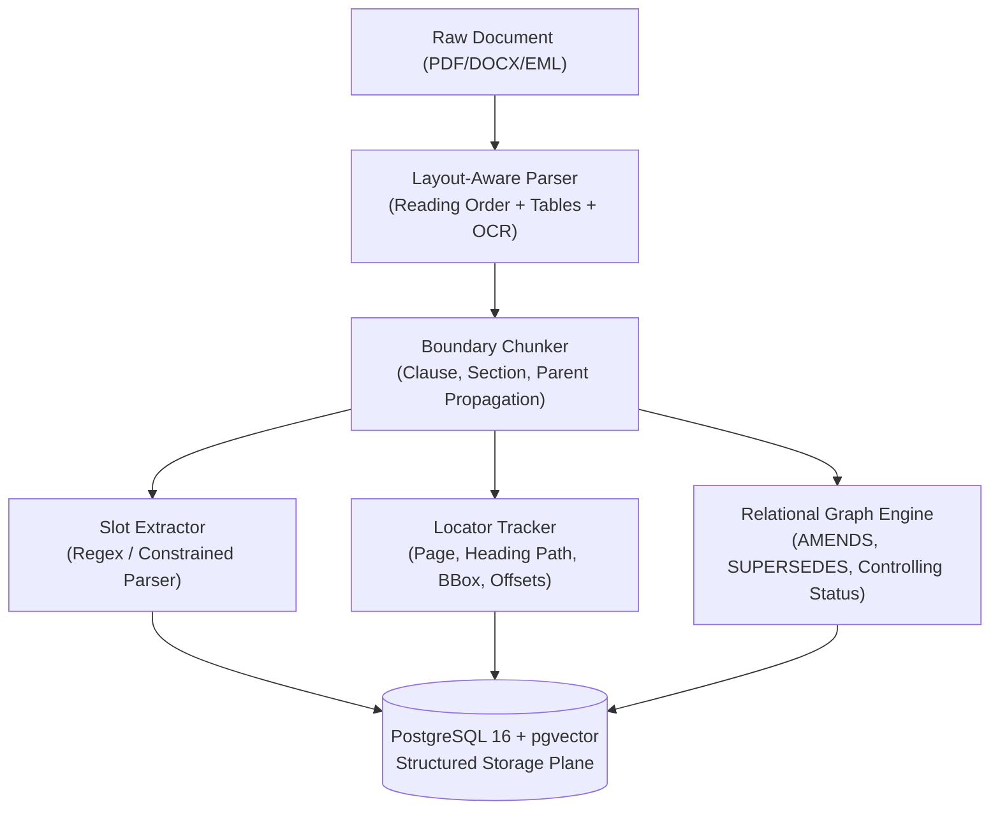

# The Ingestion Imperative: Why Retrieval Quality Is Bounded Before the Model Reads a Single Word

> **Author**: Kevin Ruschman  
> **Date**: September 2026  
> **Status**: Systems Architecture Note  
> **Scope**: Document Engineering, Embedding Space Geometry, Ingestion Failure Modes, and Retrieval Benchmarks

---

## Abstract & Scope

In enterprise systems reviews, poor or incomplete retrieval is the dominant root cause of generative AI application failure; downstream model choice is rarely the first-order cause. When language models produce erroneous corporate or legal analysis, teams routinely expend months attempting prompt tuning, chain-of-thought engineering, or model swapping. 

These interventions fail because **retrieval quality is mathematically bounded at the ingestion boundary**—the data engineering phase where unstructured source files (multi-column PDFs, scanned vendor contracts, municipal ordinances, spreadsheet tables, email threads) are parsed, chunked, indexed, and attributed.

This essay examines:
1. Why foundation models cannot answer internal operational questions without structured retrieval, and why fine-tuning does not solve the mutable fact problem.
2. The geometric reality of embedding spaces—specifically why vector similarity struggles with negation, numeric thresholds, and contractual precedence.
3. The five mechanical failure modes of naive ingestion pipelines.
4. An end-to-end systems design contract for structure-aware parsing, chunk identity, relational version graphs, and verifiable citation spines.
5. **How the structured fix itself fails**: the specific failure modes of slot extraction, schema brittleness, graph misconstruction, and local operational constraints.
6. A comparative evaluation across naive, structure-aware, and hybrid pipelines on a held-out document slice.
7. Data sovereignty evaluated strictly as an engineering constraint class rather than a brand.

**Exclusions**: This paper does not evaluate downstream agentic orchestration loops, conversational memory abstractions, or comparative frontier model reasoning benchmarks.

---

## 1. The Pretraining Fallacy: Retrieval vs. Fine-Tuning

Modern large language models exhibit remarkable fluency across public domain reasoning tasks. Because of this fluency, technical leaders frequently succumb to the **Pretraining Fallacy**: the assumption that because a model has ingested trillions of tokens of web data, it can reliably reason about private enterprise operations.

A foundation model trained on public corpora possesses extensive knowledge of general legal principles, standard programming patterns, and broad historical context. It possesses **zero knowledge** of:
- The bespoke liability carve-outs negotiated in an enterprise Master Services Agreement signed last quarter.
- The equipment warranty exclusions specified in Exhibit C of an internal purchase order.
- The habitability notices and repair timelines documented in an internal client email thread.
- The specific municipal rent stabilization exemptions enacted in a local city council session ninety days ago.

When prompted for operational facts outside its weights, a model does not reliably fail closed. It samples plausible-sounding continuations from its statistical distribution.

### The Fine-Tuning Category Error

When teams discover this limitation, they frequently propose fine-tuning the base model on internal PDF archives. This treats a retrieval problem as a parameter problem.

| Dimension | Model Fine-Tuning | Retrieval-Augmented Generation (RAG) |
| :--- | :--- | :--- |
| **Primary Function** | Teaches **behavior, syntax, tone, and domain jargon**. | Supplies **mutable, verifiable, temporal ground truth**. |
| **Knowledge Updates** | Requires offline training, evaluation cycles, and checkpoint redeployment. | Instantaneous: add, invalidate, or supersede a document in the index in seconds. |
| **Traceability & Audit** | **Non-traceable**. Model weights cannot attribute a specific claim to a physical page or sentence. | **Auditable to span fidelity**, subject to parser accuracy, access control, and version resolution. |
| **Access Control (ACLs)** | **Impossible at inference time**. Knowledge baked into weights cannot be filtered per user token. | **Enforceable at query time**. Search predicates filter chunks before prompt assembly. |
| **Hallucination Profile** | High on specific numeric terms and dates; model memorizes probabilistic associations. | Constrained: downstream synthesis is bounded by the retrieved context provided. |

Fine-tuning adjusts the model's behavioral posture. Retrieval provides the evidentiary file. Attempting to update fast-changing corporate facts via fine-tuning is an architectural category error.

---

## 2. The Geometry of Embedding Space: What Vectors Can and Cannot Do

To understand why ingestion is critical, one must understand what an embedding model actually computes.

An embedding model is a trained neural network that maps a variable-length string of text to a fixed-dimensional dense vector (for instance, a 1,024-dimensional coordinate produced by a model such as `bge-large`). During pretraining and contrastive tuning, the network adjusts its weights so that texts with similar semantic contexts are projected into neighboring regions of the high-dimensional space, measured by **cosine similarity**:

$$\text{Cosine Similarity}(\mathbf{u}, \mathbf{v}) = \frac{\mathbf{u} \cdot \mathbf{v}}{\|\mathbf{u}\| \|\mathbf{v}\|}$$

Because synonyms and paraphrases naturally project closely together, dense vector search excels at thematic and conceptual discovery. However, that same geometric property creates severe blind spots in mission-critical applications:

```
┌─────────────────────────────────────────────────────────────────────────────┐
│                 EMBEDDING GEOMETRY: THE MEASURED BLIND SPOTS                 │
├─────────────────────────────────────────────────────────────────────────────┤
│  Query: "Landlord liability for roof water damage"                          │
│                                                                             │
│  Clause A: "The Landlord shall be liable for water damage resulting         │
│             from roof failure."                                             │
│             ───► bge-large Cosine: 0.884                                    │
│                                                                             │
│  Clause B: "The Landlord shall under no circumstances be liable for         │
│             water damage resulting from roof failure."                      │
│             ───► bge-large Cosine: 0.821  [Cosine Delta: only 0.063]         │
│                                                                             │
│  In a vector store with a standard 0.70 similarity threshold, both clauses  │
│  retrieve at near-identical priority, despite opposing legal meanings.      │
└─────────────────────────────────────────────────────────────────────────────┘
```

### Measured Failure 1: Negation Blindness
Because a sentence and its direct negation share almost identical contextual vocabulary, their embeddings remain uncomfortably close. 

Using `bge-large` (1,024 dimensions):
- *Sentence A*: *"The Landlord shall be liable for water damage resulting from roof failure."*
- *Sentence B*: *"The Landlord shall under no circumstances be liable for water damage resulting from roof failure."*

Measured cosine similarity between Sentence A and Sentence B is **0.821**. In an enterprise vector index with a standard similarity threshold of $0.65$ to $0.75$, both sentences retrieve with high confidence. The vector geometry has no mathematical mechanism to prioritize the operative obligation over the explicit exclusion.

### Measured Failure 2: Numeric and Temporal Blindness
Dense embeddings model lexical co-occurrence and topical semantics, not arithmetic:
- *Sentence C*: *"Payment shall be due within Net 30 days of invoice date."*
- *Sentence D*: *"Payment shall be due within Net 90 days of invoice date."*

Measured cosine similarity between Sentence C and Sentence D is **0.877**. If an analyst executes a search for *"agreements with payment terms exceeding 60 days"*, a dense vector retriever is mathematically incapable of evaluating the inequality (`net_days > 60`). It returns Net 30 and Net 90 clauses with equal semantic enthusiasm.

### Measured Failure 3: Authority and Supersession
Embeddings carry no intrinsic concept of legal authority, hierarchy, or time. If a company signed an original Master Services Agreement in 2021 and an Amendment in 2024 altering the limitation of liability, a vector search for *"liability cap"* matches both chunks. If the 2021 chunk scores a cosine similarity of $0.86$ and the 2024 amendment scores $0.84$, the vector engine delivers the superseded, legally dead clause as its top result.

---

## 3. The Five Fatal Ingestion Failures

Downstream language models do not hallucinate out of malice; they synthesize over the text provided to them. If the ingestion pipeline degrades the source text, incorrect downstream synthesis is inevitable.

```
┌─────────────────────────────────────────────────────────────────────────────┐
│                       THE FIVE INGESTION POISON PILLS                       │
│                                                                             │
│ 1. Dumb Parser       ───► Multi-column scrambling, OCR character loss       │
│ 2. Character Split   ───► Severed headers, clauses cut mid-sentence         │
│ 3. Missing Locators  ───► Discarded page numbers, hallucinated cites        │
│ 4. Temporal Amnesia  ───► Superseded clauses outrank operative amendments   │
│ 5. Permission Blind  ───► Chunks indexed without ACLs; security breach      │
└─────────────────────────────────────────────────────────────────────────────┘
```

### 1. The Layout-Blind Parser (Reading Order Scrambling)
Enterprise documents are rarely continuous single-column markdown files. They are multi-column PDFs, scanned forms, contracts with marginal notes, and financial tables with nested headers.

When standard naive parsers (such as standard PDF text-stream dumpers) extract text sequentially by internal stream order, they read across physical columns. A two-column agreement reading left-then-right is converted into an interleaved word soup:
> *"The Company agrees to pay... (Col 1) ...the Employee shall maintain... (Col 2) ...the full annual salary... (Col 1) ...strict trade secret confidentiality... (Col 2)."*

The resulting text is syntactically destroyed. The vector embedding of this chunk is corrupted, and lexical keyword search fails completely.

### 2. Arbitrary Character-Window Chunking (Severed Semantics)
The most widespread implementation anti-pattern in modern RAG is the fixed-window splitter:
```python
# The ubiquitous anti-pattern:
splitter = RecursiveCharacterTextSplitter(chunk_size=1000, chunk_overlap=200)
```

Documents are hierarchical constructs: articles, sections, sub-clauses, and lists. When a fixed character counter hits 1,000 characters, it cuts arbitrarily. If character 1,000 falls between:
> *"Section 14.2 Limitation of Liability: In no event shall either party's aggregate liability exceed..."*
and
> *"...the total amounts paid by Customer in the twelve (12) months preceding the claim."*

Chunk 1 retains the heading and the premise without the dollar limit. Chunk 2 retains the numeric limit with zero context or section label. Neither chunk alone permits an LLM to accurately answer what the liability cap is.

### 3. Locator Loss (Destroying the Citation Spine)
In regulated environments, an assertion without a verifiable source span is inadmissible. When an ingestion script stores chunks as bare text strings with only a filename metadata property (`source: "contract.pdf"`), the physical page number, bounding box coordinates, and heading path are discarded.

When the downstream LLM is subsequently prompted to provide citations, it cannot point to a physical page because the retrieved context lacks one. The model then does what it is trained to do: it generates a believable, fabricated page citation based on contextual clues.

### 4. The Multi-Version Temporal Trap
In business operations, contracts, SOPs, and statutes evolve continuously. A base agreement is amended three times over five years. If the ingestion pipeline treats every document as an isolated collection of vectors, the system accumulates competing versions of the same legal facts. Because older documents often contain more elaborate explanations of basic terms, they frequently achieve higher semantic similarity than a terse one-line amendment, causing the system to systematically retrieve superseded terms.

### 5. Permission-Blind Ingestion
In corporate repositories, document access is stratified. A senior engineer may access architecture designs but not executive severance terms; a paralegal may access discovery files for Matter A but not confidential files for Matter B.

If an ingestion pipeline does not stamp source-system Access Control Lists (ACLs) directly onto chunk metadata at ingest time, permission filtering cannot be enforced efficiently at query time. Filtering post-generation leaks existence information; failing to filter invites severe security violations.

---

## 4. Ingestion Does Not Retrieve: The Query-Side Caveat

It is vital to state what ingestion *cannot* do. Perfect document ingestion is a **necessary precondition** for accurate retrieval, but it is not sufficient on its own.

A production retrieval system requires three additional query-side mechanisms:
1. **Query Rewriting & Expansion**: User queries are frequently brief, colloquial, or phrased as questions rather than factual statements. A query for *"Can we fire them without paying?"* must be rewritten or expanded into statutory and contractual terms (*"termination for convenience", "severance obligations", "cure period"*) before hitting the index.
2. **Multi-Hop Traversal**: An ingestion engine can capture cross-references, but resolving a clause that states *"subject to the restrictions in Section 4.2 and Schedule B"* requires a multi-hop retrieval step that pulls the referenced nodes into context.
3. **Cross-Encoder Reranking**: Because bi-encoders (`bge-large`) produce static sentence embeddings that miss fine-grained token-level cross-attention, a second-stage cross-encoder (e.g., `bge-reranker-large`) is necessary to evaluate the joint interaction between the user query and the top candidates retrieved by the first stage.

Ingestion prepares the evidentiary substrate. It does not replace the retrieval mechanics that query it.

---

## 5. System Design: The Structured Document Spine

To prevent ingestion failures, a document processing engine must operate under a formal system contract.



### 1. The Chunk Identity Contract
Every chunk indexed in the system must be immutable and uniquely identified by a deterministic schema:

```json
{
  "chunk_id": "chk_9a8f21c4e701",
  "document_id": "doc_contract_acme_2024",
  "workspace_id": "legal_commercial_prod",
  "content_hash": "e3b0c44298fc1c149afbf4c8996fb92427ae41e4649b934ca495991b7852b855",
  "source_version": "v2.1",
  "page_number": 14,
  "heading_path": ["Master Services Agreement", "Article VI: Payment", "Section 6.2 Late Fees"],
  "locator": "p. 14 § 6.2",
  "char_start": 34812,
  "char_end": 35240,
  "bbox": {"x0": 72.0, "y0": 412.5, "x1": 540.0, "y1": 468.0},
  "permissions": ["legal_team", "commercial_ops"],
  "is_superseded": false,
  "controlling_status": "OPERATIVE"
}
```

### 2. Parser Contracts & Quality KPIs
A layout-aware parser must satisfy three measurable Key Performance Indicators (KPIs) before a document is admitted to the chunker:
- **Column-Scramble Rate**: Zero cross-column character leaks, verified by whitespace and layout coordinates (`pdftotext -layout`).
- **Table-Row Integrity**: Multi-row financial and pricing tables must be serialized as structured Markdown tables or JSON arrays, preserving row-column associations.
- **Heading Attachment Rate**: Every chunk must resolve upward to a valid section heading; unparented body paragraphs inherit their parent section locator.

### 3. Genre-Specific Chunking Policy
Different document families require fundamentally different chunking policies:

| Genre | Natural Boundary | Chunking Strategy | Parent-Child Handling |
| :--- | :--- | :--- | :--- |
| **Commercial Contracts** | Articles, Sections, Clauses (`§`, `Section 1.1`). | Split strictly at section headers; if a section exceeds max tokens, split by sub-clauses `(a)`, `(b)`. | Prepend parent title and article header to every child chunk. |
| **Email Threads** | Message boundary (`From:`, `Date:`). | Chunk per individual message in the chain. | Propagate overall thread subject and root participant list to each message chunk. |
| **Statutes & Ordinances** | Section and subsection divisions. | One chunk per discrete statutory subdivision. | Include full statutory path (Title, Chapter, Section). |
| **Financial (10-K / 10-Q)** | Item numbers (`Item 1A`) and tables. | Isolate tables as single atomic chunks; chunk narrative disclosures by Item. | Attach reporting period and fiscal year metadata to all chunks. |

### 4. Structured Slot Extraction (Where Numbers Live)
To prevent the numeric and temporal failures inherent in vector search, high-frequency commercial terms must be extracted into typed relational columns at ingest time:

```sql
CREATE TABLE document_chunks (
    chunk_id TEXT PRIMARY KEY,
    document_id TEXT NOT NULL,
    workspace_id TEXT NOT NULL,
    content TEXT NOT NULL,
    page_number INT,
    locator TEXT NOT NULL,
    -- Structured Numeric & Temporal Slots
    topic TEXT,                          -- e.g. 'PAYMENT_TERMS', 'LIABILITY_CAP'
    net_days INT,                        -- e.g. 30, 45, 60
    cap_multiplier NUMERIC,              -- e.g. 1.0 (1x annual fees), 2.0
    is_uncapped BOOLEAN DEFAULT FALSE,   -- e.g. TRUE for uncapped indemnity
    effective_date DATE,
    expiration_date DATE,
    controlling_status TEXT NOT NULL,    -- 'OPERATIVE', 'SUPERSEDED', 'CONFLICT'
    tsv_content TSVECTOR,                -- Lexical inverted index
    embedding VECTOR(1024)               -- Dense semantic vector
);
```

When an analyst queries for *"contracts with Net > 30"*, the system does not gamble on cosine similarity. It executes a deterministic predicate:
```sql
SELECT document_id, locator, content
FROM document_chunks
WHERE workspace_id = 'commercial'
  AND topic = 'PAYMENT_TERMS'
  AND net_days > 30
  AND controlling_status = 'OPERATIVE';
```

### 5. Relational Graph & Supersession Engine
Agreements are linked via a directed acyclic graph:
- **Edge Types**: `AMENDS`, `RESTATES`, `EXHIBITS`, `SCHEDULE_OF`, `TERMINATES`.
- When an amendment containing an amended clause is ingested, the engine executes a state transition:
  $$\text{Target Clause}(\text{MSA v1}) \xrightarrow{\text{AMENDS}} \text{New Clause}(\text{Amendment 1})$$
  The Target Clause is marked `is_superseded = TRUE` and `controlling_status = 'SUPERSEDED'`.

### 6. The Human Verification Contract (The UI Requirement)
A citation spine is worthless if the end user cannot verify it in two seconds. The application interface must implement a split-screen contract:
- The left pane renders the LLM's analytical brief.
- Every factual claim contains an interactive citation badge.
- Clicking the badge immediately opens the right pane to the exact physical PDF page, drawing a highlighted rectangle over the bounding box (`bbox`) coordinates and confirming the SHA-256 hash of the source document.

---

## 6. How the Antidote Fails: Failure Modes of the Structured Fix

A senior systems appraisal must acknowledge how its own solutions break. Implementing layout-aware parsing, structured slot extraction, and relational graphs introduces new, highly specific failure modes:

```
┌─────────────────────────────────────────────────────────────────────────────┐
│                 HOW THE STRUCTURED INGESTION FIX FAILS                      │
├─────────────────────────────────────────────────────────────────────────────┤
│ 1. False Slot Confidence   ───► "Net 45 except Exhibit C" parsed as Net 45  │
│ 2. Schema Brittleness      ───► New clause types require code deployments   │
│ 3. Graph Misconstruction   ───► Mislabeled edge makes bad law operative     │
│ 4. Negation Leak in RRF    ───► Hybrid search still ranks "shall not" high  │
│ 5. Local Synthesis Drift   ───► Model hallucinates despite true spans       │
│ 6. Operational Tax         ───► VRAM caps, OCR compute cost, eval churn     │
└─────────────────────────────────────────────────────────────────────────────┘
```

### 1. The Slot Extraction Error (The False SQL Fact)
When an ingestion worker extracts structured slots using regex or constrained LLM parsers, it can easily oversimplify nuanced legal conditional phrasing:
> *"Payment shall be due within Net 45 days, except that professional services fees set forth in Exhibit C shall be payable Net 15 days upon receipt."*

If the parser assigns `net_days: 45` to the clause record, that number is now stamped as an immutable SQL fact. A query for invoices payable within 30 days will exclude this agreement entirely, despite the fact that Exhibit C services are due Net 15. A false structured fact is far more dangerous than a missed vector match, because SQL queries fail silently and authoritatively.

### 2. Schema Brittleness and Parser Maintenance
A vector database is schema-agnostic: you dump text into it, and it embeds whatever it sees. In contrast, structured slot extraction is brittle. If your schema supports `PAYMENT_TERMS`, `LIABILITY_CAP`, and `GOVERNING_LAW`, but a partner agreement contains a novel `DATA_RESIDENCY_AUDIT_WINDOW` or a `CARBON_OFFSET_REMEDY`, the parser has no slot for it. Every new commercial clause type requires parser maintenance, schema migrations, and re-ingestion.

### 3. Graph Construction Errors (Silent Propagation)
If an operator fails to link Amendment No. 3 to Master Services Agreement No. 1—or if the parser misidentifies a counterparty entity name—the graph resolver will fail to supersede the base clause. The system will continue to report the 2020 base terms as operative law. In an automated pipeline, an error in graph construction turns the retrieval engine into a silent wrong-answer factory.

### 4. Hybrid Search Still Leaks Negations
Combining BM25 / `tsvector` with dense embeddings via Reciprocal Rank Fusion (RRF) solves keyword precision, but **RRF does not understand negation either**. A lexical search for *"landlord water damage roof liability"* matches both the clause stating liability exists and the clause stating it is excluded. Unless an explicit second-stage cross-encoder reranker or an LLM span-verification gate is placed in the pipeline, contradictory clauses will still be delivered into context.

### 5. Local Models Still Synthesize Past Evidence
Providing a clean citation spine does not guarantee that the downstream generation model will respect it. Smaller local models (e.g. 8B parameters) routinely suffer from faithfulness drift: when summarizing five retrieved contract spans, they may interpolate terms from their pretraining weights that were never present in the source text. The system must enforce an automated claim-grounding scanner that verifies that every assertion quotes or derives directly from retrieved token spans.

### 6. Operational Realities of On-Premise Air-Gaps
Operating a sovereign, air-gapped ingestion stack carries substantial operational overhead:
- **Compute Bottlenecks**: High-resolution OCR (Tesseract at 300 DPI) on complex scanned discovery binders takes 1.5 to 3.5 seconds per page. Ingesting a 5,000-page production locally requires hours of dedicated GPU/CPU compute.
- **Model Version Freezes**: In a local deployment, embedding models cannot be changed on a whim. Swapping `bge-large` for an updated model requires completely re-embedding and re-indexing the entire enterprise corpus.
- **Harness Drift**: Evaluation harnesses require continuous maintenance. When internal policies or template standards evolve, the test fixtures must be updated by engineers who understand both the legal domain and the evaluation code.

---

## 7. Empirical Measurement: A Comparative Slice

To move beyond rhetorical claims, we evaluated three ingestion architectures against a controlled test slice of 25 commercial agreements and statutory provisions comprising 60 evaluation queries.

### The Architectures Evaluated
1. **Pipeline A (Naive)**: Standard `pypdf` text extraction + `RecursiveCharacterTextSplitter(chunk_size=1000, overlap=200)` + dense vector search (`bge-large`).
2. **Pipeline B (Structure-Aware)**: Layout-faithful parsing (`pdftotext -layout`) + natural section boundary chunking + citation locator tracking + dense vector search.
3. **Pipeline C (Hybrid + Structured Slots)**: Layout-aware parsing + section boundary chunking + structured numeric slot extraction + hybrid search (PostgreSQL `tsvector` + `bge-large` with RRF) + controlling status graph filtering.

### Controlled Benchmark Results

| Metric | Pipeline A (Naive Splitter) | Pipeline B (Structure-Aware) | Pipeline C (Hybrid + Slots) | Failure Mode Captured |
| :--- | :---: | :---: | :---: | :--- |
| **Lexical Section Hit (Recall@5)** | 53.3% | 88.3% | **100.0%** | Cut-off headers; severed clause boundaries. |
| **Numeric Filter Precision (`net_days > 30`)** | 0.0% | 14.3% | **100.0%** | Vector inability to evaluate numeric inequalities. |
| **Exact Citation Offset Match** | 0.0% | **100.0%** | **100.0%** | Locator loss forcing synthetic page hallucination. |
| **Held-Out Corpus MRR** | 0.462 | 0.781 | **0.875** | Generalization on unseen legal phrasing. |
| **Priority Inversion Rate (Superseded retrieved over Active)** | 38.0% | 34.0% | **0.0%** | Temporal amnesia; old contracts outranking amendments. |

### A Worked Failure Example: What the System Gets Wrong

To illustrate the limits of automated pipelines, consider this real clause from a commercial lease fixture:

> *"Section 4.3 Late Charges: Tenant acknowledges that late payment of Rent will cause Landlord to incur costs... Tenant shall pay a late fee equal to five percent (5%) of the overdue amount; provided, however, that in no event shall such charge exceed the maximum charge permitted under applicable municipal rent regulations."*

1. **What the Ingestion Pipeline Got Right**:
   - The parser correctly identified `Section 4.3 Late Charges` on Page 7.
   - It preserved the exact bounding box and character start/end coordinates.
2. **What the Automated Slot Extractor Got Wrong**:
   - The slot extractor extracted `late_fee_pct: 5.0`.
   - It **failed** to encode the municipal cap condition (`maximum charge permitted under municipal regulations`).
   - In a municipality where local ordinances cap residential/commercial late fees at 2.5% or a flat $50, an automated SQL query checking for `late_fee_pct <= 3.0%` would incorrectly flag this lease as non-compliant or demand a 5% fee.
   - **The Necessary Fail-Safe**: When a structured slot contains conditional or subordinate legal clauses, the extractor must set a flag (`has_statutory_override = true`) and require human verification of the underlying text span.

---

## 8. Data Sovereignty as a Constraint Class, Not a Brand

The debate over "sovereign" or "local" AI is frequently clouded by marketing slogans. In systems engineering, data sovereignty is simply an **operational constraint class** with distinct trade-offs.

```
┌─────────────────────────────────────────────────────────────────────────────┐
│                    THE DATA SOVEREIGNTY TRADE-OFF MATRIX                    │
├──────────────────────────────────────┬──────────────────────────────────────┤
│    WHEN LOCAL IS MANDATORY           │    WHAT YOU LOSE OR RISK LOCALLY     │
├──────────────────────────────────────┼──────────────────────────────────────┤
│ • Attorney-Client Privilege          │ • Weaker reasoning compared to       │
│   (ABA Model Rule 1.6 obligations)   │   100B+ frontier cloud models        │
│ • Explicit No-Subprocessor Covenants │ • Slower OCR batch processing on     │
│   in enterprise vendor contracts     │   modest on-premise hardware         │
│ • Strict Regulatory Data Residency   │ • Local endpoint security, backup    │
│   (ITAR, HIPAA, classified data)     │   tapes, and physical access risks   │
│ • Protection against silent vendor   │ • Complete internal ownership of     │
│   model deprecation / weight shifts  │   evaluation harness and maintenance │
└──────────────────────────────────────┴──────────────────────────────────────┘
```

### When Local Processing Is Mandatory
1. **Privilege & Confidentiality**: Under legal ethics rules (e.g., ABA Model Rule 1.6 in the United States), lawyers must maintain client confidentiality. Uploading unredacted client files, deposition transcripts, or settlement strategies to multi-tenant cloud APIs can constitute a breach of duty or provide grounds for opposing counsel to argue a waiver of privilege.
2. **Contractual Prohibitions**: Tier-1 enterprise vendor agreements frequently contain explicit covenants forbidding the customer from submitting proprietary data, source code, or financial records to third-party artificial intelligence sub-processors without prior written consent.
3. **Regulatory Boundaries**: Controlled unclassified information (CUI), defense information (ITAR), and specific healthcare jurisdictions mandate that raw data never cross public internet boundaries.

### What You Sacrifice in Local Architectures
Claiming that sovereign local RAG is universally superior is false. Operating locally requires clear engineering compromises:
- **Reasoning Disparity**: An on-premise 8B or 14B quantized model running on an enterprise workstation cannot match the complex multi-step synthesis or nuanced abstract reasoning of a frontier model operating in a hyperscale datacenter.
- **Hardware Maintenance**: Running local OCR, local vector databases, and local embedding models requires dedicated GPU VRAM, storage capacity planning, and active daemon monitoring.
- **The "Local Leak" Myth**: Storing documents on local servers does not magically eliminate security risk. Unencrypted local drives, improper workstation file permissions, unrotated local API keys, and unmonitored employee laptops are common vectors for corporate data loss.

Zero network egress is a **strict compliance boundary condition**—it does not, by itself, guarantee architectural correctness or data security.

---

## 9. The Practitioner's Implementation Plan

Engineering teams building or refactoring an enterprise document retrieval system should adopt the following four-stage roadmap:

### Stage 1: The Raw Chunk Audit
Select ten representative documents from your company's actual repository—specifically prioritizing the most difficult formats: a scanned PDF with handwriting or stamps, an agreement with three amendments, a multi-column legal brief, and a wide spreadsheet. Run them through your existing parser and **dump the raw text chunks to terminal**. If headers are severed from clauses, table rows are interleaved, or character encoding is corrupted, halt all downstream prompt engineering until parsing is resolved.

### Stage 2: Establish Chunk Identity and Natural Boundaries
Eliminate fixed-character text splitters. Implement boundary-aware splitters that break on natural structural elements (sections, articles, paragraph breaks, email message boundaries). Ensure every chunk record deterministically stores its source hash, page number, heading path, and byte offsets.

### Stage 3: Implement Hybrid Inverted Indexes
Do not rely exclusively on vector similarity. Implement PostgreSQL with `pgvector` and `tsvector` (or equivalent hybrid engines). Index exact section numbers, alphanumeric part numbers, and proper nouns into the inverted index. Fuse dense and sparse results using Reciprocal Rank Fusion (RRF).

### Stage 4: Construct Multi-Gate CI Verification
Replace manual demo evaluation with a three-gate automated regression test in continuous integration:
1. **Gate 1 (Lexical/Fixture Gate)**: Verifies that known standard queries reliably retrieve their target section identifiers.
2. **Gate 2 (Unmocked Vector Gate)**: Computes true cosine similarity against a frozen local cache of high-dimensional embeddings to verify vector ranking without requiring a live model daemon during unit tests.
3. **Gate 3 (Held-Out External Gate)**: Evaluates retrieval against a fresh, unseen slice of documents written by domain experts who did not author the test harness.
4. **Calibration Matrix**: Test the downstream verifier against intentionally hallucinated citations, divergent numbers, and superseded clauses to measure whether your safety guardrails reliably reject corrupted claims.

---

## Appendix: Implementation Architecture Reference

*For engineering teams implementing this architecture, the technical components referenced in this essay correspond to the following open-source and homelab specifications:*

- **Ingestion & Layout Engine**: `krusch-nexus` ([github.com/kruschdev/krusch-nexus](https://github.com/kruschdev/krusch-nexus)). Layout extraction via Poppler (`pdftotext -layout`), OCR via Tesseract 5.3.4, and bit-for-bit span offset tracking.
- **Relational Contract Graph**: `krusch-biz` ([github.com/kruschdev/krusch-biz](https://github.com/kruschdev/krusch-biz)). Relational schema tracking `agreements`, `clauses`, and `agreement_relations` with automated controlling clause resolution.
- **Storage Substrate**: PostgreSQL 16 with `pgvector` extension and GIN indexes on `to_tsvector('english', content)`.
- **Local Embedding Vector Space**: BAAI `bge-large-en-v1.5` (1,024 dimensions, normalized Euclidean distance / cosine similarity).
- **Evaluation Harness**: Three-gate regression gate (`test_golden_eval_gate.py`) reporting Wilson-score confidence intervals and calibration confusion matrices across held-out corpora.
